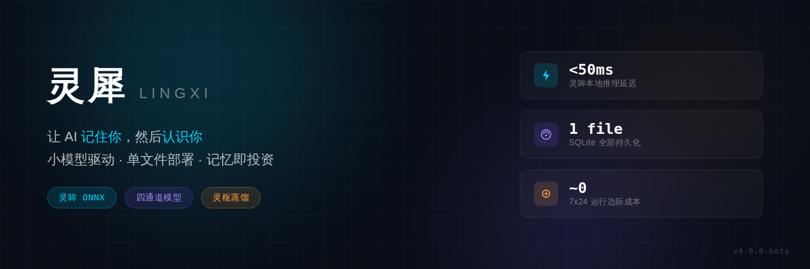
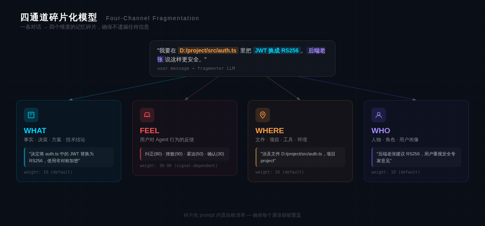
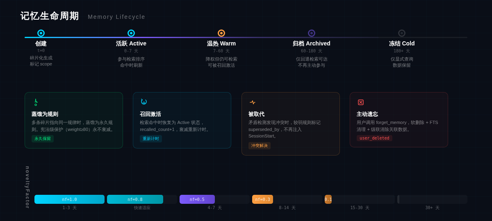
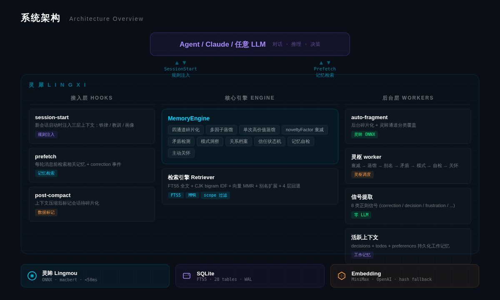

# 灵犀 Lingxi

<p align="center">
  
</p>

> 你消耗的 token，不该只是消费，更应该是你的投资。

灵犀是一个小模型驱动的 Agent 记忆系统。它不是帮 AI 存更多对话——而是帮 AI 从对话中提炼出你是谁、你在意什么、它应该怎么做。

---

## 为什么做灵犀

现有的 Agent 记忆系统解决的是存储问题：把对话存起来，下次检索出来。这不够。

一个人和 AI 合作了三个月，AI 应该知道：

- 你讨厌冗余确认，喜欢它直接动手
- 你在做 TypeScript 项目时偏好 pnpm，做 Python 时用 uv
- 上次那个数据库迁移做到一半，今天应该接着来
- 两周前你纠正过它删注释的习惯，它不该再犯

这些不是"检索"能解决的问题。这是**策展**——从碎片中提炼知识，把知识转化为行为。

灵犀做的就是这个。

---

## 核心差异

### 灵眸：本地小模型引擎，不是 LLM 套壳

大多数记忆系统的每条消息都要经过大模型：分类、提取、检索、判断。每一步都在花钱、在等待、在把数据发往云端。

灵犀不同。它内置**灵眸**——一个本地 ONNX 推理引擎（基于 macbert-2stage，<50ms），负责日常的信号分类和通道识别。只有真正需要深度理解时才调用大模型。

| 操作 | 传统记忆系统 | 灵犀 |
|------|-------------|------|
| 每条消息的信号提取 | 1 次 LLM 调用 | **0 次**（正则 + 规则，<5ms） |
| 通道分类（WHAT/FEEL/WHERE/WHO） | LLM 分类 | **灵眸 ONNX**（<50ms，零成本） |
| 记忆检索 | 200-500ms | **<100ms**（FTS5 + 向量 MMR，本地） |
| 后台反思（灵枢） | 每次 = LLM 调用 | **触发判断零成本**，仅蒸馏时调用 |
| 7×24 运行边际成本 | 每次心跳 = token 费用 | **接近零**（规则引擎检查） |

这意味着灵犀可以持续运行、持续观察、持续学习，而不用担心 API 账单。

### 策展，不是存储

存储是把对话原封不动地存起来。策展是从对话中提炼出**值得记住的东西**，然后决定哪些该强化、哪些该衰减、哪些该遗忘。

灵犀的策展管线：

```
对话 → 四通道碎片化 → 信号提取 → 衰减打分 → 多因子蒸馏 → 规则注入
       WHAT/FEEL/      8类轻量      novelty     6因子评分    铁律/教训
       WHERE/WHO       信号正则      Factor      单次高价值    /建议 三级
```

每一层都在回答不同的问题：
- **碎片化**：这段对话里有哪些值得记住的信息？
- **信号提取**：用户是在纠正我、认可我、还是催促我？
- **衰减**：这条记忆还重要吗？被使用过吗？
- **蒸馏**：多条碎片是否在指向同一个规律？
- **注入**：下次对话时，Agent 应该知道什么？

### 单文件，不是四个 Docker

灵犀的全部持久化是一个 SQLite 文件。没有 MongoDB、没有 Elasticsearch、没有 Milvus、没有 Redis、没有 Neo4j。

```
灵犀的全部基础设施：
  memory.db    ← 一个文件，28 张表，WAL 模式

主流记忆系统的典型基础设施：
  mongodb / postgres   ← 文档/关系存储
  elasticsearch        ← 全文检索
  milvus / qdrant      ← 向量数据库
  redis                ← 缓存 + 消息队列
  neo4j                ← 知识图谱
```

单文件意味着：备份就是复制文件，迁移就是移动文件，调试就是打开数据库看数据。

---

## 四通道模型

<p align="center">
  
</p>

灵犀把每条记忆分成四个通道，确保不遗漏任何维度的信息：

| 通道 | 含义 | 示例 |
|------|------|------|
| **WHAT** | 事实、决策、方案、技术结论 | "JWT 换成 RS256，用非对称加密" |
| **FEEL** | 用户对 Agent 行为的反馈 | "你又把我的注释删了"（纠正，weight 80） |
| **WHERE** | 文件、项目、工具、环境 | "在 src/auth/login.ts 里改" |
| **WHO** | 人物、角色、用户画像 | "用户偏好直接执行，不要反复确认" |

碎片化 prompt 内置自检清单——如果一条对话提到了文件路径但没有产生 WHERE 碎片，系统会发出警告。

---

## 记忆生命周期

<p align="center">
  
</p>

```
 ┌────────────────────────────────────────────────────────────────┐
 │                                                                │
 │  创建 ──→ 活跃 ──→ 温热 ──→ 归档 ──→ 冻结                     │
 │   │        │        │        │                                  │
 │   │        │        │        │     ┌── 蒸馏为规则（永久保留）   │
 │   │        │        │        └────→│                            │
 │   │        │        │              └── 被取代（superseded）     │
 │   │        │        │                                           │
 │   │        │        └── 宪法级保护（FEEL weight≥80，永不衰减）  │
 │   │        │                                                    │
 │   │        └── 检索命中时恢复为活跃                             │
 │   │                                                             │
 │   └── 作用域标记：project / domain / global                     │
 │                                                                 │
 └─────────────────────────────────────────────────────────────────┘
```

**noveltyFactor** 控制学习节奏——系统越年轻，学习越激进：

| 系统年龄 | 衰减窗口 | 蒸馏门槛 | 类比 |
|----------|---------|---------|------|
| 1-3 天 | ~1 天 | 1 条 session | "用户最敏感，快速适应" |
| 4-7 天 | ~4 天 | 3 条 session | "一周内看到变化" |
| 8-14 天 | ~6 天 | 4 条 session | "感知减弱" |
| 30+ 天 | 7 天 | 5 条 session | "稳态维护" |

---

## 灵枢：后台反思

灵犀在后台周期性地进行"灵枢"——类似人类睡眠中的记忆巩固。灵枢是灵犀的中枢调度系统，负责衰减、蒸馏、矛盾检测和主动关怀。

**触发条件**（任一满足，阈值随系统年龄自适应）：

- 轻量信号积累超过阈值（默认 50 条）
- 距上次灵枢超过 12 小时 + 至少 10 条新信号
- 新碎片数量超过阈值（默认 100 条）

**灵枢运行时做的事：**

```
灵枢
  ├── 衰减扫描      宪法级碎片受保护，其余按 noveltyFactor 调整窗口
  ├── 多因子蒸馏    跨 session 聚类，6 因子评分，生成三级规则
  ├── 单次蒸馏      高价值纠正信号直接蒸馏，向量去重
  ├── 术语别名      检测废弃术语，自动映射到当前用词
  ├── 矛盾检测      语义相似但立场相反的碎片，尝试解决链
  ├── 模式洞察      14 天窗口聚类，发现上升趋势
  ├── 自检          零命中率/通道偏差/灵眸准确率
  └── 主动关怀      基于用户情绪分布生成提醒
```

---

## SessionStart：记忆到行为

每次新对话开始时，灵犀注入三层上下文：

```
[AgentMemory] 铁律约束 — 不可覆盖:
  不要在回复中使用 emoji — 基于 5 次对话 (5月20日→5月28日)
  执行操作前不要反复确认 — 基于 3 次对话 (5月22日→5月27日)

[AgentMemory] 教训规则:
  修改文件时保留原有注释 — 基于 2 次对话 (5月25日→5月26日)

[AgentMemory] 用户偏好事实 — 基于历史对话蒸馏:
  - 自主执行：用户偏好直接行动而非讨论方案
  - 直接反馈：用户认可直接指出问题而非委婉包装

[AgentMemory] 用户画像 — 长期观察总结:
  · 用户有编程背景，可以深入技术细节
  · 决策时将安全/信任作为首要考量

[AgentMemory] 任务接续 — 上一个会话中已确认、正在执行中的任务:
  数据库 migration 重构：已完成 Phase 1-3，等待 Phase 4 开始
```

每条规则附带**溯源标注**——基于多少次对话、时间跨度。Agent 看到的不只是"该怎么做"，还有"这个结论从哪来的"。

---

## 检索引擎

```
用户消息
  │
  ├── 别名扩展        "灵犀" → "Lingxi" + "AgentMemory"
  │
  ├── 关键词过滤      alpha token → FTS5 MATCH（精确匹配）
  │                   CJK bigram → IDF 排序（稀有词优先）
  │
  ├── 向量检索        cosine similarity，最低分 0.30
  │
  ├── 复合排序        vector × 0.5 + anchor_weight × 0.3 + decay × 0.2
  │                   + scope 加分（匹配当前项目 or 全局）
  │
  ├── MMR 去重        相似度 > 0.95 的重复片段跳过
  │
  └── Token 预算      ~200 tokens（600 chars），不浪费上下文窗口
```

**Correction 增强**：当检测到用户纠正信号时，自动检索过去 30 天内的相似纠正事件，注入为参考。

**4 层回退**：向量检索无结果时，依次尝试 archive 搜索 → 原始 transcript → 项目文件。

---

## 架构

<p align="center">
  
</p>

```
                         ┌──────────────────────┐
                         │    Agent / Claude     │
                         └──────┬───────┬────────┘
                                │       │
                    SessionStart│       │Prefetch
                    (规则注入)  │       │(记忆检索)
                                │       │
┌───────────────────────────────┴───────┴────────────────────────────┐
│                          灵犀 Lingxi                              │
│                                                                    │
│  ┌─────────────┐  ┌──────────────┐  ┌───────────────────────────┐ │
│  │ session-    │  │ prefetch     │  │ auto-fragment             │ │
│  │ start       │  │              │  │ (后台碎片化 + 灵眸分类)    │ │
│  └──────┬──────┘  └──────┬───────┘  └─────────────┬─────────────┘ │
│         │                │                         │               │
│  ┌──────┴────────────────┴─────────────────────────┴─────────────┐│
│  │                    MemoryEngine (核心引擎)                     ││
│  │  碎片化 · 衰减 · 蒸馏 · 关系档案 · 矛盾检测 · 模式洞察       ││
│  └───────────────────────────┬───────────────────────────────────┘│
│                              │                                     │
│  ┌───────────┐  ┌────────────┴───────────┐  ┌──────────────────┐ │
│  │ 灵眸      │  │ SQLite + FTS5          │  │ 灵枢 worker      │ │
│  │ ONNX 推理 │  │ 单文件 memory.db       │  │ (后台反思)       │ │
│  │ <50ms     │  │ 28 张表 · 30 migration │  │                  │ │
│  └───────────┘  └────────────────────────┘  └──────────────────┘ │
│                                                                    │
└────────────────────────────────────────────────────────────────────┘
```

---

## 平台适配

| 平台 | 集成方式 | 状态 |
|------|---------|------|
| Claude Code | Skill hooks + MCP Server | 生产运行中 |
| Codex CLI | TOML + CODEX.md | 适配器就绪 |
| OpenClaw | JSON + AGENTS.md | 适配器就绪 |
| Hermes | YAML + SOUL.md | 适配器就绪 |
| Generic | System prompt + Heartbeat | 适配器就绪 |

---

## 快速开始

```bash
git clone https://github.com/Alience92/Lingxi.git
cd Lingxi
npm install
npx tsc

# 启动 MCP server
node dist/skill/mcp/server.js

# 运行评测仪表板（用真实使用数据评估记忆质量）
npx tsx tools/eval-dashboard.ts [projectId]
```

### 环境变量

| 变量 | 用途 | 必需 |
|------|------|------|
| `AGENTMEMORY_API_KEY` | Embedding API key (MiniMax/OpenAI 兼容) | 是（否则使用哈希回退） |
| `AGENTMEMORY_EMBEDDING_URL` | Embedding API 地址 | 否（默认 MiniMax） |
| `DEEPSEEK_API_KEY` | 碎片化 LLM key（支持任意 OpenAI 兼容 API） | 是（碎片化需要 LLM） |
| `AGENTMEMORY_HOME` | 数据库目录 | 否（默认 `~/.agentmemory`） |
| `AGENTMEMORY_MODEL_DIR` | 灵眸 ONNX 模型目录 | 否（默认 `tools/two-stage-output`） |

---

## 与同类产品的对比

以下对比基于各项目的公开文档和代码。标注"未公开"的数据表示官方未提供或无法验证。

### 记忆系统对比

| | **灵犀** | **Mem0** | **Letta** (MemGPT) | **Zep / Graphiti** | **MemOS** |
|---|---|---|---|---|---|
| **语言** | TypeScript | Python | Python | Python | Python |
| **部署** | 单文件 SQLite | pip + Docker / 云 | pip + Docker | Docker + Neo4j | Docker（4 服务） |
| **存储** | SQLite + FTS5 + 向量 BLOB | 向量 DB + BM25 + Neo4j | 文件系统 + token 空间 | Neo4j 时序知识图谱 | MongoDB + ES + Milvus + Redis |
| **本地推理** | **灵眸 ONNX（<50ms，零成本）** | 支持本地模型 | 模型无关 | 多提供商，支持本地 | 本地插件（SQLite + FTS5） |
| **蒸馏/巩固** | 多因子蒸馏 + 单次高价值蒸馏 | ADD/UPDATE/DELETE 循环 | Agent 自编辑记忆块 | 时序知识图谱 + 自动失效 | 调度器管理生命周期 |
| **行为闭环** | **三级规则注入约束行为** | 检索层注入 prompt | Agent 自管理记忆块 | Smart Context 装配 | 张量层 + LoRA 注入 |
| **用户建模** | 关系档案 + 信任状态机 + 画像 | 用户/会话/Agent 三级 | 记忆块自管理 | 事实时效窗口 | MemCube + 生命周期元数据 |
| **学习节奏** | **noveltyFactor 阶梯自适应** | 固定 | 固定 | 时序感知 | 反馈驱动 |
| **主动检测** | 矛盾/模式/自检/关怀 | 无 | 无 | 矛盾自动失效 | 无 |
| **LoCoMo** | 内置探针仪表板 | 91.6（自报） | 74.0（自报） | 未公开 | 未公开 |
| **GitHub Stars** | 新项目 | ~48K | ~14K | ~20K (Graphiti) | ~4K |
| **License** | ISC | Apache 2.0 | 开源 | 开源 | 开源 |

### Agent 框架的记忆能力对比

| | **灵犀** | **OpenAI Agents SDK** | **LangGraph** | **CrewAI** | **Claude MCP + Dreaming** |
|---|---|---|---|---|---|
| **定位** | 独立记忆系统 | Agent 框架 | Agent 编排 | 多 Agent 框架 | 协议 + 平台记忆 |
| **记忆架构** | 4 通道 + 作用域 + 蒸馏 | 会话历史 + 自定义 Session | Checkpointer 快照 | 短期 + 长期 + 实体 | Memory Bank + Dreaming |
| **跨 session 记忆** | **核心能力** | 需第三方（如 Mem0） | 需 LangMem 扩展 | SQLite + RAG | Dreaming 巩固 |
| **蒸馏** | 多因子 + 单次高价值 | 无（仅截断/摘要） | LangMem 提取 | 有限 RAG | 跨 session 模式提取 |
| **本地推理** | **灵眸 ONNX** | 无 | 模型无关 | 可配置 | 无（云端） |
| **独立部署** | 单文件 | 框架内 | 框架内 | 框架内 | 平台托管 |

**关于基准测试的说明**：LoCoMo 和 LongMemEval 只测试对话召回率。独立测试（RankSquire, 2026.05）显示 Mem0 在 50K session 规模下 30 天后有效准确率降至 ~49%，原因是数据过时和实体矛盾。厂商自报的基准应视为上限。灵犀选择用真实使用数据的探针仪表板而非外部基准，因为我们认为"你实际用了之后效果如何"比"在标准数据集上跑分如何"更重要。

---

## 评测

灵犀不依赖外部数据集评测。它用真实使用数据衡量自身效果：

```bash
npx tsx tools/eval-dashboard.ts
```

输出：
```
灵犀 v4 探针式评测报告

=== 检索命中率 ===
总检索: 342
命中: 287 (83.9%)
零命中: 55 (16.1%)
平均返回: 3.2 条

=== 碎片使用频率 ===
  从未被召回: 890 (34.2%)
  低频(1-3): 1120 (43.1%)
  中频(4-10): 420 (16.2%)
  高频(>10): 170 (6.5%)

=== 综合评分 ===
检索命中率: 83.9% (权重 50%)
蒸馏覆盖率: 12.4% (权重 30%)
反零命中率: 83.9% (权重 20%)
综合质量分: 76.4/100
```

---

## 设计文档

- [四通道标签宪法](docs/label-constitution.md) — WHAT/FEEL/WHERE/WHO 的分类规范与边界判例
- [关系档案 Spec](docs/relationship-profile-spec.md) — friction / autonomy / trust 状态机设计
- [审查教训吸收机制](design-docs/2026-05-29-review-lesson-absorption.md) — 单次高价值蒸馏的设计推导
- [L0 规则违反事件分析](design-docs/incidents/2026-05-29-L0-rule-violation.md) — 一次注入架构缺陷的完整复盘

---

## 技术栈

| 组件 | 选择 | 理由 |
|------|------|------|
| 语言 | TypeScript (ESM) | 类型安全 + Agent 生态 |
| 数据库 | SQLite (better-sqlite3) | 单文件、WAL 并发、跨平台 |
| 全文检索 | FTS5 | SQLite 原生，零额外服务 |
| 本地推理 | 灵眸（ONNX Runtime + macbert） | 进程内推理，<50ms |
| Embedding | MiniMax embo-01 / OpenAI 兼容 | 1536-dim，带哈希回退 |
| 碎片化 LLM | 任意 OpenAI 兼容 API（推荐 DeepSeek / MiniMax，性价比最优） | 按需调用 |

---

## 路线图

**v4.1 — 记忆层完善**
- [ ] 作用域检索（scope 过滤从加分升级为过滤）
- [ ] 遗忘级联（删除时清理 anchors/links/rule_sources）
- [ ] 冷启动蜡烛机制（新用户引导 → 渐进式消退）

**v4.2 — Agent 化**
- [ ] 脱离 Claude Code Skill，独立长驻进程
- [ ] 感知层 + 决策层 + 行动层三层 Agent 架构
- [ ] 灵眸扩展（介入分类器、情绪分类器、价值分类器）

**v5.0 — 完整 Agent**
- [ ] 实时对话介入
- [ ] 跨 Agent 记忆共享
- [ ] 自增强循环（运行数据 → 训练数据 → 更好的灵眸模型）

---

## License

ISC
